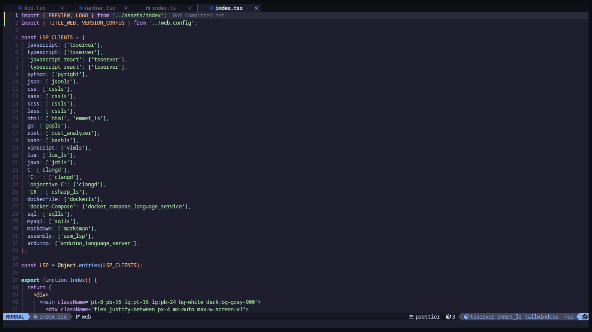

<h1 align="center" >Neovim.Config</h1>

<p align="center">IDE configuration for Neovim</p>

<p align="center">
 
 
 
 
 
</p>

<p align= "center">
    
</p>

This repository contains my custom configuration for Neovim, an advanced text editor that can be turned into a powerful integrated development environment (IDE). With my configuration, Neovim becomes a virtually full-featured IDE, supporting multiple programming languages and offering a smooth and agile user experience thanks to the use of the **[Lazy](https://github.com/folke/lazy.nvim)** plugin manager. You'll find everything you need to start working with Neovim right away, from installing plugins to customizing keyboard shortcuts and display options - enjoy the productivity Neovim has to offer!.

## Index

- [Requeriments](#🔨-Requirements)
- [Features](#🦉-Features)
- [Plugins](./docs/Plugins.md)
- [Keyboard shortcuts](./docs/KeyboardShortcuts.md)
- [Supported languages](#🔬-Supported-languages)
  - [Install LSP clients](#Install-LSP-Clients)
  - [LSP configurations](#LSP-configuration)
- [Configurations](#🛠-Configurations)
- [Aditional functions](#📦-Additional-functions)
- [How to install](#🧪-How-to-install)
  - [Fast installation](#Fast-installation)
  - [Ststep by step installation](#Step-by-step-installation)
- [Project status](#🎢-Project-status)

## 😸 Why ?

This repository was created to share my custom configuration of Neovim, an advanced text editor that I have used for a long time for my daily programming work. I have spent many hours customizing and refining my configuration to make Neovim perfectly suited to my needs, and I think other programmers could benefit from it.

## 🔨 Requirements

In order to be able to use the code editor correctly, it is necessary to have some programs previously installed.

- [Neovim >= 0.5.0](https://github.com/neovim/neovim)
- [NerdFonts (Recommended source: FiraCode Nerd Font)](https://www.nerdfonts.com/)
- [NodeJS](https://nodejs.org/en/)
- [Python](https://www.python.org/)
  <!-- - [Go](https://go.dev/) -->
  <!-- - [Rust](https://www.rust-lang.org/) -->
- [C++](./docs/Instalar%20compilador%20de%20C%2B%2B.md)

## 🦉 Features

- [x] Support for multiple programming languages (Syntax coloring, Code auto-completion, Snippets)
- [x] Commands to quickly execute and compile code.
- [x] Visually pleasing and developer friendly interface.
- [x] Useful information for the status bar.
- [x] Convenient [keyboard shortcuts](./docs/KeyboardShortcuts.md) based on the standard of other IDEs like VSCode.

## 🔬 Supported languages

- `javascript` - tsserver
- `typescript` - tsserver
- `javascript react` - tsserver
- `typescript react` - tsserver
- `python` - pyright
- `json` - jsonls
- `css` - cssls
- `sass` - cssls
- `scss` - cssls
- `less` - cssls
- `html` - html - emmet_ls
- `go` - gopls
- `rust` - rust_analyzer
- `bash` - bashls
- `vimscript` - vimls
- `lua` - lua_ls
- `java` - jdtls
- `C` - clangd
- `C++` - clangd
- `Objective C` - clangd
- `C#` - csharp_ls
- `Dockerfile` - dockerls
- `Docker-Compose` - docker_compose_language_service
- `SQL` - sqlls
- `MYSQL` - sqlls
- `Markdown` - marksman
- `Assembly` - asm_lsp
- `Arduino` - arduino_language_server

### ⚗ Install LSP Clients

It is important to mention that not all languages will be installed automatically, this is done to improve the performance of the configuration and each person can decide which languages he/she needs.

By default the most common languages `javascript`, `typescript`, `html`, `css`, `json`, `markdown`, `python`, `lua` will be installed, the other languages can be installed using the command `:Mason` and look for the name of the LSP client already configured for the language you need.

Another option is to modify the `LSP_CLIENTS` variable found in [globals.lua](./lua/globals.lua), here you can add the names of the servers you need and the Mason plugin will install them if they are not already installed.

### ⚙ LSP configuration

You can also change, add or remove LSP clients for each language, the settings for this can be found in the [lsp.lua](./lua/plugins/lsp.lua) file and can be guided in the settings of the [lsp-config](https://github.com/neovim/nvim-lspconfig/blob/master/doc/server_configurations.md) plugin.
You can also install the clients with the [Mason](https://github.com/williamboman/mason.nvim) plugin, you can use the `:Mason` command or add it to the `LSP_CLIENTS` line in [globals.lua](./lua/globals.lua).

## 🛠 Configurations

The editor has some settings that can be useful and quick to configure, these are found in the [globals.lua](./lua/globals.lua) file, and are global variables that are used throughout the deeper configuration of the plugins.

| VARIABLE                 | TYPE    | FUNCTION                                                                                                                                                                                                                                                       |
| ------------------------ | ------- | -------------------------------------------------------------------------------------------------------------------------------------------------------------------------------------------------------------------------------------------------------------- |
| COLOR_THEME              | String  | This variable stores the name of the theme to be used in the editor.                                                                                                                                                                                           |
| BACKGROUND_TRANSPARENT   | Boolean | This variable indicates whether a transparent background is desired                                                                                                                                                                                            |
| STATUSBAR                | Table   | This table contains properties that allow you to modify the style and layout of the status bar (lualine).                                                                                                                                                      |
| ALPHA                    | String  | This variable stores the ASCII drawing that is displayed when the editor is opened. There are already drawings loaded in the configuration in the [drawings.lua](./lua/utils/drawings.lua) file, you just need to import the drawing you like or add your own. |
| COLOR_LINE               | Table   | This variable stores a color table to use when highlighting the cursor line.                                                                                                                                                                                   |
| TODO_PATTERN             | String  | This variable stores the search pattern to search for TODO comments in the code.                                                                                                                                                                               |
| TODO_ICONS               | Table   | This variable indicates the table of icons to represent each TODO comment.                                                                                                                                                                                     |
| COMPILERS_EXECUTABLES    | Table   | This variable stores a table with the structure of how a script should be written to execute a code.                                                                                                                                                           |
| ICONS                    | Table   | This variable stores a table of most of the icons found throughout the editor for general use.                                                                                                                                                                 |
| GIT_SYMBOLS              | Table   | This variable stores a table with the icons or symbols that you will use to identify changes in a git repository.                                                                                                                                              |
| TREE_SYMBOLS             | Table   | This variable stores a table with the icons to be used by the Neotree file manager.                                                                                                                                                                            |
| TREE_WIDTH               | Integer | This variable stores the width of the file manager.                                                                                                                                                                                                            |
| TREE_DIRECTION           | String  | This variable stores from which point the file manager will open, left or right.                                                                                                                                                                               |
| CMP_GHOST_TEXT           | Boolean | This variable indicates whether you want a virtual text preview of the autocomplete options.                                                                                                                                                                   |
| LSP_CLIENTS              | Table   | This variable contains the names of the LSP clients to be installed automatically.                                                                                                                                                                             |
| EXCLUDE_FORMATTERS_FILES | Table   | This variable contains the file type names that will not use neoformat to be formatted.                                                                                                                                                                        |
| CODE_FORMATTERS          | Table   | This variable contains the names of the language and the code formatter to be used for that language.                                                                                                                                                          |

## 📦 Additional functions

The editor has some additional commands for different proportions, here is a list of the available commands.

| COMMAND                      | FUNCTION                                                                                                                                        |
| ---------------------------- | ----------------------------------------------------------------------------------------------------------------------------------------------- |
| `:InitPrettierConfig`        | The command creates a `.pretierrc` file in your project's root path.                                                                            |
| `:InitEditorConfig`          | The command creates a `.editorconfig` file in your project root path                                                                            |
| `:InitDockerfile`            | The command creates a `dockerfile` file in your project root path                                                                               |
| `:InitDockerCompose`         | The command creates a `docker-compose.yaml` file in your project root path                                                                      |
| `:InitSassEstructure <path>` | The command creates a default file structure for sass, the command receives as a parameter the path where the folders are to be created         |
| `:InitNodeEstructure <path>` | The command creates a default file structure for node project, the command receives as a parameter the path where the folders are to be created |
| `:RunPython`                 | The command executes the python file at the side of the editor.                                                                                 |
| `:RunJavaScript`             | The command executes the javascript file at the side of the editor                                                                              |
| `:RunTypeScript`             | The command compiles the typescript file, and then executes the resulting javascript file next to the editor.                                   |
| `:RunScss`                   | The command compiles the current scss file                                                                                                      |
| `:RunGo`                     | The command compiles the open go file and then executes the resulting binary at the side of the editor.                                         |
| `:RunCPP`                    | The command compiles the open c++ file and then executes the resulting binary at the side of the editor.                                        |
| `:RunC`                      | The command compiles the open c file and then executes the resulting binary at the side of the editor.                                          |
| `:OpenHTML`                  | This command opens the current HTML file in your default browser.                                                                               |

## 🧪 How to install

### Fast installation

Once you have the above requirements you can proceed to install the configuration.

1. The first thing is to have all the code formatters you like such as `Prettier`, `Black`, `Clang-format`, etc. installed on your system.
   You can install them through the mason plugin by running the `:Mason` command and searching for the formatter of your choice but I recommend installing them independently.

2. Then you can install the configuration using the following command depending on your environment.

   _Windows_

   ```sh
   git clone https://github.com/EddyBel/Neovim.Config.git $HOME\AppData\Local\nvim --depth 1 && nvim
   ```

   _Linux_ / _Macos_

   ```bash
   git clone https://github.com/EddyBel/Neovim.Config.git ~/.config/nvim --depth 1 && nvim
   ```

   This command will clone the latest version of the repository in the configuration path of neovim, once cloned, neovim will be opened with the `nvim` command so that lazy proceeds with the installation of all plugins.

### Step by step installation

Once you have fulfilled the necessary requirements for the correct functioning of the configuration, you can proceed to the installation of this configuration.

1. The first thing is to clone the configuration repository this can be done with git or download it directly from github. to clone it with git you can use this command:

   ```bash
   git clone https://github.com/EddyBel/Neovim.Config.git
   ```

2. Next is to move to the cloned repository folder once there you must copy the files `init.lua`, `lazy-lock.json` and finally the `lua` folder, these must go in your neovim configuration folder, for Linux systems you can use `~/.config/nvim`, for Windows you can use `C:\Users\Username\AppData\Local\nvim` or wherever neovim defines the configuration path.

   _Windows_

   ```sh
   cd Neovim.Config
   xcopy init.lua lazy-lock.json lua C:\Users\Username\AppData\Local\nvim /s /e /i
   ```

   _Linux_ / _Macos_

   ```bash
   cd Neovim.Config
   cp init.lua lazy-lock.json lua ~/.config/nvim
   ```

3. Before opening neovim it is important to install the code formatters, these will allow your code to maintain a good structure and design, for this we use the [Neoformat](https://github.com/sbdchd/neoformat) plugin to manage the formatters but we must install them separately with the following commands:

   ##### [Prettier](https://prettier.io/)

   ```bash
   npm install -g prettier
   ```

   ##### [Black](https://pypi.org/project/black/)

   ```bash
   pip install black
   ```

   ##### [Clang-format](https://pypi.org/project/clang-format/)

   ```bash
   pip install clang-format
   ```

4. Finally you can open the editor with the command `nvim` and lazy will install all the plugins automatically, and that's it! you can start coding.

## 🎢 Project status

The project is constantly changing because it is my usual code editor and I will be improving and adding things as I see fit.

## 📑 LICENCE

This project is released under the terms of the MIT license. The MIT license allows users to use, copy, modify and distribute the source code of the project with certain restrictions and requirements. For more information on the terms and conditions of the MIT license, please refer to the license file included with this project or visit https://opensource.org/licenses/MIT.

---

<p align="center">
  <a href="https://github.com/EddyBel" target="_blank">
    
  </a> 
  <a href="https://www.linkedin.com/in/eduardo-rangel-eddybel/" target="_blank">
    
  </a> 
</p>
