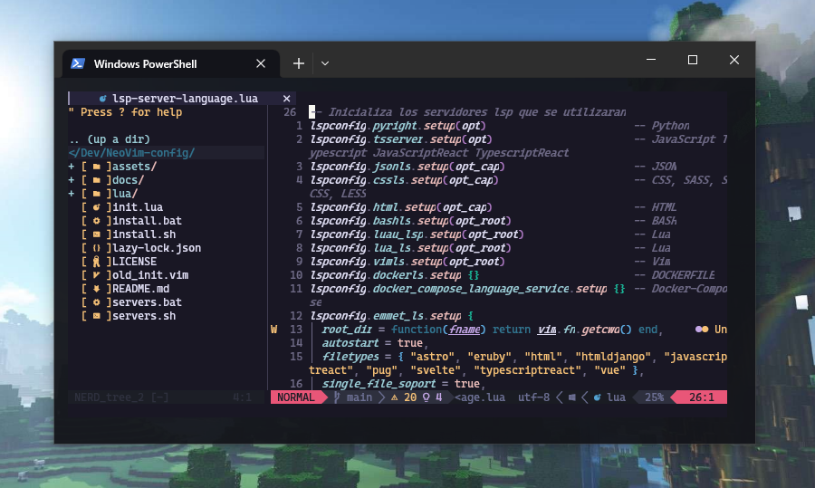

<h1 align="center" >Neovim configuración</h1>

<p align="center">
 
 
 
 
 
</p>

<p align="center" >Configuración de NeoVim</p>



This repository contains my custom configuration for Neovim, an advanced text editor that can be turned into a powerful integrated development environment (IDE). With my configuration, Neovim becomes a virtually full-featured IDE, supporting multiple programming languages and offering a smooth and agile user experience thanks to the use of the **[Lazy](https://github.com/folke/lazy.nvim)** plugin manager. You'll find everything you need to start working with Neovim right away, from installing plugins to customizing keyboard shortcuts and display options - enjoy the productivity Neovim has to offer!

## 😸 Why ?

This repository was created to share my custom configuration of Neovim, an advanced text editor that I have used for a long time for my daily programming work. I have spent many hours customizing and refining my configuration to make Neovim perfectly suited to my needs, and I think other programmers could benefit from it.

My goal in sharing this configuration is to help others get a more productive and efficient programming experience in Neovim by providing a solid and customizable foundation for using this powerful text editor. In addition, the use of the Lazy plugin manager ensures that the setup is easy to install and maintain, which should save users time and effort.

I hope this Neovim setup will be useful to other programmers and allow them to enjoy the productivity that this advanced text editor can offer.

## 🔨 Requirements

In order to be able to use the code editor correctly, it is necessary to have some programs previously installed.

- [Neovim](https://github.com/neovim/neovim)
- [NodeJS](https://nodejs.org/en/)
- [Scoop](https://scoop.sh/)
- [Compiler C++](./docs/Instalar%20compilador%20de%20C%2B%2B.md)

## 🦉 Features

- [x] Multi-language support.
- [x] Syntax coloring.
- [x] Code auto-completion.

## 🧪 How to use

The first thing is to have neovim installed and have the necessary configuration folder like this one:

### Windows

```bash
 C:\Users\$USER\AppData\Local\nvim
```

### Linux

```bash
~/.config/nvim
```

Once everything is ready you can clone the github repository of the configuration and enter the repository folder.

```bash
git clone https://github.com/EddyBel/NeoVim-config.git
cd NeoVim-config
```

The next step is to copy the configuration files **init.lua** and **lua** to the neovim configuration folder.

Finally, before loading the configuration it is necessary to install the LSP servers, they will take care of syntax highlighting and code autocompletion.

To install them you can use the file [servers.bat](./servers.bat) or [servers.sh](./servers.sh) to run them automatically or install them one by one:

```bash
npm i -g pyright # Python
npm i -g typescript # JavaScript, TypeScript
npm i -g typescript-language-server # JavaScript, TypeScript
npm i -g emmet-ls # HTML
npm i -g vscode-langservers-extracted # CSS, SASS, LESS, JSON
npm i -g @tailwindcss/language-server # TailwindCss
npm i -g @microsoft/compose-language-service # Docker-compose
npm i -g dockerfile-language-server-nodejs # Dockerfile
npm i -g bash-language-server # Bash
npm install -g vim-language-server # Vim

scoop install lua-language-server # Lua
```

You can install other programming languages you need as indicated in the [lsp-config](https://github.com/neovim/nvim-lspconfig) repository, the language configuration file is located inside the specific config folder [lsp-server-language.lua](./lua/config/lsp-server-language.lua), you can integrate there the language you need.

Finally, just run neovim and Lazy will install and download all the listed plugins.

> Note
>
> In the repo you will find files called [install.bat](./install.bat) or [install.sh](./install.sh), these files can install neovim and load the configuration as indicated, this can help you if you do not want to manually install the configuration.

## 🎢 Project status

The project is constantly changing because it is my usual code editor and I will be improving and adding things as I see fit.

## 📑 LICENCE

This project is released under the terms of the MIT license. The MIT license allows users to use, copy, modify and distribute the source code of the project with certain restrictions and requirements. For more information on the terms and conditions of the MIT license, please refer to the license file included with this project or visit https://opensource.org/licenses/MIT.

---

<p align="center">
  <a href="https://github.com/EddyBel" target="_blank">
    
  </a> 
  <a href="https://www.linkedin.com/in/eduardo-rangel-eddybel/" target="_blank">
    
  </a> 
</p>
